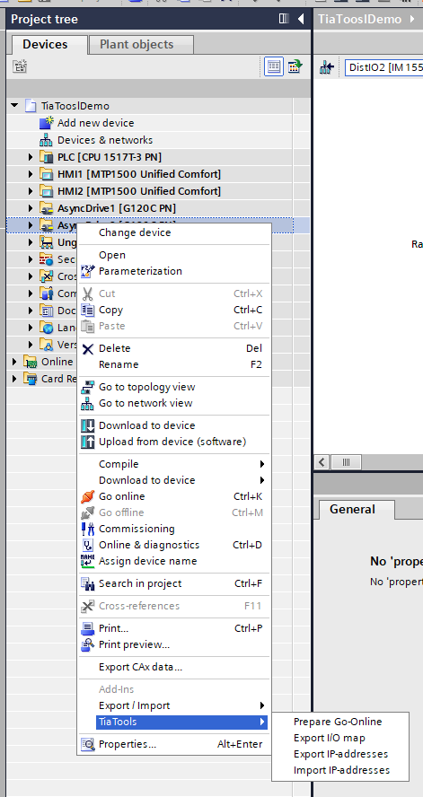
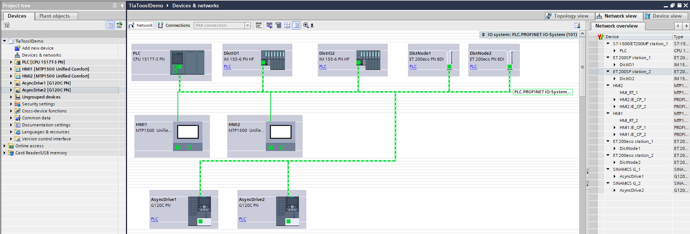
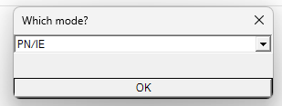
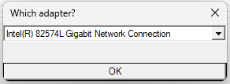
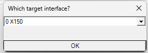

# TIA Tools

Some addins I've created for TIA portal V20 that might be usefull for others or as example to develop their own.

The functions I've implemented are:
* Prepare *Go-Online* settings for G120-drives
* Export of I/O map for all devices, i.e. you can see the adress space occupied by all devices
* Export IP-adresses and profinet-device names
* Import IP-adresses and profinet-device names




Information from Siemens: 
* [https://support.industry.siemens.com/cs/document/109773999/tia-portal-add-ins?dti=0&lc=en-US](https://support.industry.siemens.com/cs/document/109773999/tia-portal-add-ins?dti=0&lc=en-US)
* [https://docs.tia.siemens.cloud/r/en-us/v21/tia-portal-add-in-development-tools/cybersecurity-information](https://docs.tia.siemens.cloud/r/en-us/v21/tia-portal-add-in-development-tools/cybersecurity-information)
* [https://support.industry.siemens.com/cs/document/109760816/tia-portal-openness-explorer?dti=0&lc=en-CA](https://support.industry.siemens.com/cs/document/109760816/tia-portal-openness-explorer?dti=0&lc=en-CA)


If you simply want to use the Addin yourself, just copy the **bin\debug\TiaTools.addin** file to the **Addins***-folder of your TIA Installation.

**NOTICE**: Be cautions, I take no responsibility if you mess up your TIA projects with this, USE AT YOUR OWN RISK! 

# Example project
I will give an example of each addin from a Dummy-example project, the HW-overview looks like this



# Online prepare
If you have to go online on multiple G120 drives, you need to select the connection setup for each individual drive, i.e. profinet, network adapter and target port.

Whith this addin you can select all drives you wish to go online on, then it will ask for the settings to apply for all drives. After running the addin, TIA remembers the settings and just the *Go-Online* button will work.





# Export I/O map for each device

Sometimes one wants to get an overview *What hardware uses what adress-space?*

This addin creates an XML-file in the *UserFiles* directory of the project.

```xml
<?xml version="1.0" encoding="utf-8"?>
<AddressEntries xmlns:xsd="http://www.w3.org/2001/XMLSchema" xmlns:xsi="http://www.w3.org/2001/XMLSchema-instance">
  <AddressEntry>
    <Path>SINAMICS G_1/AsyncDrive1/MainTelegram Nr 1/Input</Path>
    <StartAddr>258</StartAddr>
    <Length>4</Length>
  </AddressEntry>
  <AddressEntry>
    <Path>SINAMICS G_1/AsyncDrive1/MainTelegram Nr 1/Output</Path>
    <StartAddr>258</StartAddr>
    <Length>4</Length>
  </AddressEntry>
  ...
  <AddressEntry>
    <Path>ET 200SP station_1/DQ 4/DQ 4/Output</Path>
    <StartAddr>10</StartAddr>
    <Length>1</Length>
  </AddressEntry>
  <AddressEntry>
    <Path>ET 200eco station_2/DistNode2/8 DI DC24V 4xM12/Input</Path>
    <StartAddr>101</StartAddr>
    <Length>1</Length>
  </AddressEntry>
</AddressEntries>
```

# Export/Import IP-addresses
As far as I'm aware, there is not possible to show a list of all ip-addresses in a given network or project, you must click on each HW-device and check in their configuration.

This gets boring quickly, so with this you can export and import **all IP-adresses in the entire project**, if you want to make changes you can then re-import them and the IP-adresses will be updated.

```xml
<?xml version="1.0" encoding="utf-8"?>
<IpAddrEntries xmlns:xsd="http://www.w3.org/2001/XMLSchema" xmlns:xsi="http://www.w3.org/2001/XMLSchema-instance">
  <IpAddrEntry>
    <path>S7-1500/ET200MP station_1/PLC/PROFINET interface_1</path>
    <deviceName>S7-1500/ET200MP station_1</deviceName>
    <ipAddress>192.168.0.1</ipAddress>
    <profinetDeviceName>plc.profinetxainterfacexb13a48</profinetDeviceName>
    <profinetCleanDeviceName>plc.profinet interface_1</profinetCleanDeviceName>
  </IpAddrEntry>
  <IpAddrEntry>
    <path>S7-1500/ET200MP station_1/PLC/PROFINET interface_2</path>
    <deviceName>S7-1500/ET200MP station_1</deviceName>
    <ipAddress>192.168.1.1</ipAddress>
    <profinetDeviceName>plc.profinetxainterfacexb23b08</profinetDeviceName>
    <profinetCleanDeviceName>plc.profinet interface_2</profinetCleanDeviceName>
  </IpAddrEntry>
  <IpAddrEntry>
    <path>S7-1500/ET200MP station_1/PLC/PROFINET interface GBIT_3</path>
    <deviceName>S7-1500/ET200MP station_1</deviceName>
    <ipAddress>192.168.2.1</ipAddress>
    <profinetDeviceName>plc.profinetxainterfacexagbitxb34a07</profinetDeviceName>
    <profinetCleanDeviceName>plc.profinet interface gbit_3</profinetCleanDeviceName>
  </IpAddrEntry>
  <IpAddrEntry>
    <path>HMI2/HMI2.IE_CP_1/PROFINET Interface_1</path>
    <deviceName>HMI2</deviceName>
    <ipAddress>192.168.0.8</ipAddress>
    <profinetDeviceName>hmi2.profinetxainterfacexb10656</profinetDeviceName>
    <profinetCleanDeviceName>hmi2.profinet interface_1</profinetCleanDeviceName>
  </IpAddrEntry>
  <IpAddrEntry>
    <path>HMI1/HMI1.IE_CP_1/PROFINET Interface_1</path>
    <deviceName>HMI1</deviceName>
    <ipAddress>192.168.0.7</ipAddress>
    <profinetDeviceName>hmi1.profinetxainterfacexb1f9b2</profinetDeviceName>
    <profinetCleanDeviceName>hmi1.profinet interface_1</profinetCleanDeviceName>
  </IpAddrEntry>
  <IpAddrEntry>
    <path>SINAMICS G_1/AsyncDrive1/PROFINET interface</path>
    <deviceName>SINAMICS G_1</deviceName>
    <ipAddress>192.168.0.9</ipAddress>
    <profinetDeviceName>asyncdrive1</profinetDeviceName>
    <profinetCleanDeviceName>asyncdrive1</profinetCleanDeviceName>
  </IpAddrEntry>
  <IpAddrEntry>
    <path>ET 200SP station_1/DistIO1/PROFINET interface</path>
    <deviceName>ET 200SP station_1</deviceName>
    <ipAddress>192.168.0.2</ipAddress>
    <profinetDeviceName>distio1</profinetDeviceName>
    <profinetCleanDeviceName>distio1</profinetCleanDeviceName>
  </IpAddrEntry>
  <IpAddrEntry>
  <IpAddrEntry>
    <path>ET 200eco station_2/DistNode2/PROFINET interface</path>
    <deviceName>ET 200eco station_2</deviceName>
    <ipAddress>192.168.0.5</ipAddress>
    <profinetDeviceName>distnode2</profinetDeviceName>
    <profinetCleanDeviceName>distnode2</profinetCleanDeviceName>
  </IpAddrEntry>
  ...
</IpAddrEntries>
```


## Create a empty project

After installing build tools, I only use VS Code and the terminal.

In the desired project location run:

1. ```dotnet new addin-project -P TiaAddin -N TiaAddin ```

2. ```dotnet new addin-project-tree-menu -P TiaAddin -N TiaAddin ```

3. Check correct TIA version in csproj-file, 

One example from the generated project files, here it says V19, I simply replaced it with V20
```
<HintPath>@(TiaPortalLocation)\PublicAPI\V19.AddIn\Siemens.Engineering.AddIn.dll</HintPath>
```
New
```
<HintPath>@(TiaPortalLocation)\PublicAPI\V20.AddIn\Siemens.Engineering.AddIn.dll</HintPath>
```

Also in in the `Config.xml`

```
<PackageConfiguration xmlns="http://www.siemens.com/automation/Openness/AddIn/Publisher/V19">
```

```
<PackageConfiguration xmlns="http://www.siemens.com/automation/Openness/AddIn/Publisher/V20">
```

5. Try to build, run `Ctrl+Shift+P` in VS Code and select `Run build task`

If it worked, you should end up with a addin in the `bin/debug`folder that you can drag into C:/Programs/**TIA INSTALL FOLDER**/Addins

